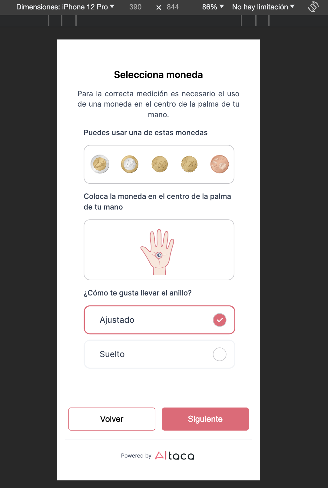
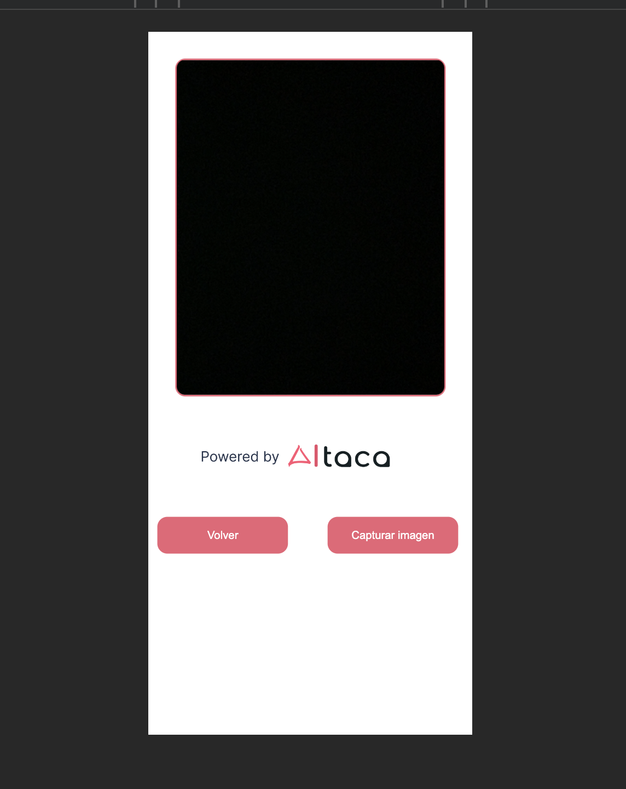
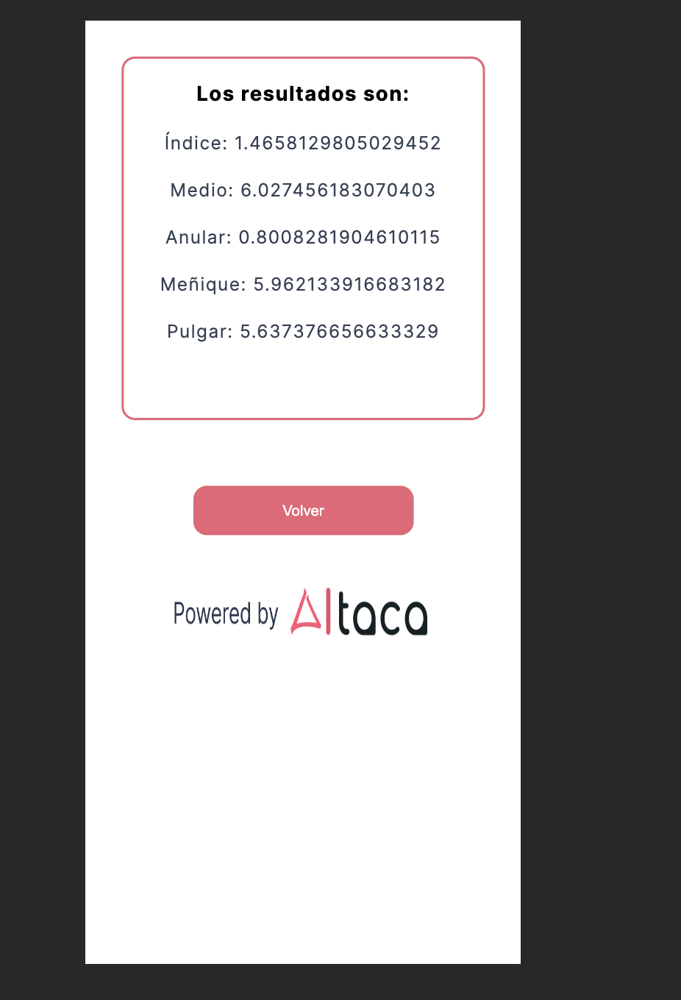

# Test Frontend : Aitaca remote.

<details>
  <summary>Contenido 📝</summary>
  <ol>
    <li><a href="#objetivo-🎯">Objetivo</a></li>
    <li><a href="#sobre-el-proyecto-🔎">Sobre el proyecto</a></li>
    <li><a href="#stack">Stack</a></li>
    <li><a href="#instalación-en-local">Instalación</a></li>
    <li><a href="#vistas">Vistas</a></li>
    <li><a href="#contribuciones">Contribuciones</a></li>
    <li><a href="#licencia">Licencia</a></li>
    <li><a href="#webgrafia">Webgrafia</a></li>
    <li><a href="#desarrollo">Desarrollo</a></li>
    <li><a href="#futuras-funcionalidades">Futuras funcionalidades</a></li>
    <li><a href="#agradecimientos">Agradecimientos</a></li>
    <li><a href="#contacto">Contacto</a></li>
  </ol>
</details>

## Objetivo 🎯

El objetivo de este proyecto es : Crear una página web para uso en dispositivos moviles, usando React que permita definar dos parametros (Coin y Fitting), tener acceso a la camara para poder enviar una foto en base64 a una Api junto los otros dos parametros y esta devuelva la respuesta la Api.

## Sobre el proyecto 🔎

En este proyecto, se ha utilizado Vite como herramienta de desarrollo, React como biblioteca para construir la interfaz y JavaScript como lenguaje de programación. Además, se ha implementado el patrón de arquitectura de datos Redux para una gestión eficiente del estado de la aplicación.

Para el envio de datos (post), se ha utilizado programación asíncrona mediante la librería Axios.
Para la gestion de la camara use react-webcam.

Se ha dado especial énfasis a la parte visual del proyecto para respetar un diseño en Figma ofrecido por la empresa, utilizando el enfoque de desarrollo Mobile First (principalmente en : IPhone 12 pro como estandar). Se utilizo Css vanilla para gestionar los estilos.

El proyecto busca cumplir con los requisitos solicitados para el Test.

## Stack

<div align="center">
<a href="https://www.reactjs.com/">
    
</a>
<a href="https://www.typescriptlang.org/es/docs/handbook/">
    
</a>

 

  

 

1. Clonar el repositorio
2. `$ npm install`
3. `$ npm run dev`
4. ...

## Vistas

Landing.


Cam.


Results.


## Contribuciones

Las sugerencias y aportaciones son siempre bienvenidas.

Puedes hacerlo de dos maneras:

1. Abriendo una issue
2. Crea un fork del repositorio
   - Crea una nueva rama
     ```
     $ git checkout -b feature/nombreUsuario-mejora
     ```
   - Haz un commit con tus cambios
     ```
     $ git commit -m 'feat: mejora X cosa'
     ```
   - Haz push a la rama
     ```
     $ git push origin feature/nombreUsuario-mejora
     ```
   - Abre una solicitud de Pull Request

## Licencia

Este proyecto se encuentra bajo licencia de "Maxi Chavez"

## Webgrafia:

Para conseguir mi objetivo he recopilado información de:

- Ejemplos de projectos anteriores.
- Documentacion oficial.
- ...

## Herramientas para el desarrollo:

- Postman => Para probar la api.
- Vite => Para iniciar el projecto (https://vitejs.dev/)
- React-webcam
- Postman
- Axios

## Desarrollo:

```js
const developer = "MaxiChavez";

console.log("Desarrollado por: " + developer);
```

## Futuras funcionalidades

✅ Renderizacion de la respuesta de la Api  
⬜ Mensajes de error al no seleccionar parametros (Coin & Fitting)  
⬜ Opcion volver a tomar la fotografia.
⬜ ...

## Agradecimientos:

Agradezco a Miguel por darme la oportunidad de realizar esta prueba.

## Contacto

<a href = "mailto:chavezmaxi@gmail.com"></a>
<a href="https://www.linkedin.com/in/maximiliano-chavez-b12877107/" target="_blank"></a>

</p>
